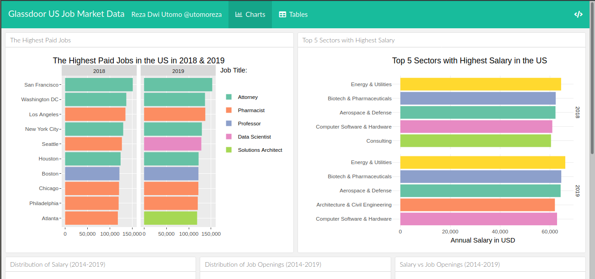

# Learning by Building IP (Interactive Plotting & Web Dashboards)

This repo consists of all folders and files needed for the project of "Learning by Building" of [Interactive Plotting & Web Dashboards](https://algorit.ma/course/web-dashboards/) course at Algoritma.

The programming language used in this repo is R. I also wrote an R markdown file of this repo so that you can view the repo tidier. I published the markdown on two sites, i.e. RPubs and GitHub. You can view it either from the following links:

* [GitHub Page](https://utomoreza.github.io/IP_LBB/)
* [RPubs](https://rpubs.com/utomoreza/IP_LBB)

Feel free if you'd like to clone or download the repo.

Thanks for visiting my repo!
